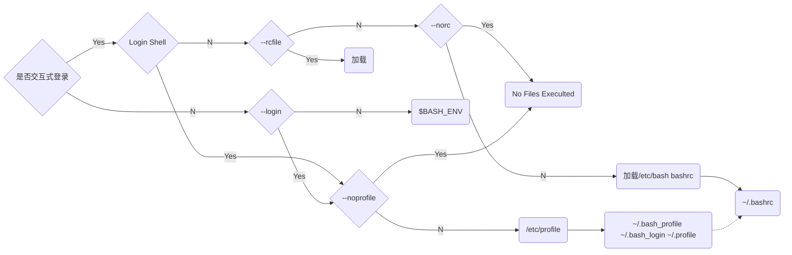
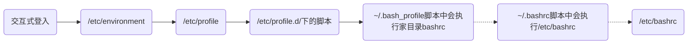

### Linux设置环境变量
```bash
export PATH=$PATH:/your/path/bin
```


#### 整体加载顺序



#### 一般环境变量



#### 系统级别

|文件|描述|备注|
|---|---|---|
|`/etc/environment`|是系统在登录时读取的第一个文件，该文件设置的是整个系统的环境，只要启动系统就会读取该文件，用于为所有进程设置环境变量。|不建议修改|
|`/etc/profile`|此文件是系统登录时执行的第二个文件。 为系统的每个用户设置环境信息，当用户第一次登录时，该文件被执行。并从/etc/profile.d目录的配置文件中搜集shell的设置。（/etc/profile可以用于设定针对全系统所有用户的环境变量，环境变量周期是永久性）。||
|`/etc/profile.d/`下的脚本|存放加载变量的脚本|一般PATH还有一些自用需开机启动的脚本我会放这里|
|`/etc/bashrc`|是针对所有用户的bash初始化文件，在此中设定的环境变量将应用于所有用户的shell中，此文件会在用户每次打开shell时执行一次。（即每次新开一个终端，都会执行/etc/bashrc）||


#### 用户级别

|文件|描述|备注|
|---|---|---|
|`~/.profile`|对应当前登录用户的profile文件，用于定制当前用户的个人工作环境(变量是永久性)，每个用户都可使用该文件输入专用于自己使用的shell信息,当用户登录时,该文件仅仅执行一次!默认情况下,他设置一些环境变量,执行用户的.bashrc文件。|推荐放置个人设置|
|`~/.bashrc`|该文件包含专用于你的bash shell的bash信息，当登录时以及每次打开新的shell时，该文件被读取。(`~/.bashrc`只针对当前用户，变量的生命周期是永久的)|不推荐放到这|
|`~/.bash_profile`或`~./bash_login`|<ul><li>`~/.bash_profile`是交互式login 方式进入 bash 运行的</li><li>`~/.bashrc`是交互式 non-login 方式进入 bash 运行的通常二者设置大致相同，所以通常前者会调用后者</li><li>每个用户都可使用该文件输入专用于自己使用的shell信息，当用户登录时，该文件仅仅执行一次。默认情况下，他设置一些环境变量，执行用户的.bashrc文件。（如果`~/`目录下没有.bash_profile则新建立一个）这里是推荐放置个人设置的地方。当一个shell关闭时，在bash_profile中定义的系统变量则会失效。因此，每打开一个新的shell时都要运行一次source bash_profile.而且针对当前用户。</li></ul>||
|`~/.pam_environment`|用户级的环境变量设置文件||
|`~/.bash_logout`|当每次退出系统（退出bash shell）时，执行该文件。另外,/etc/profile中设定的变量(全局)的可以作用于任何用户,而~/.bashrc等中设定的变量(局部)只能继承 /etc/profile中的变量,他们是”父子”关系。||
